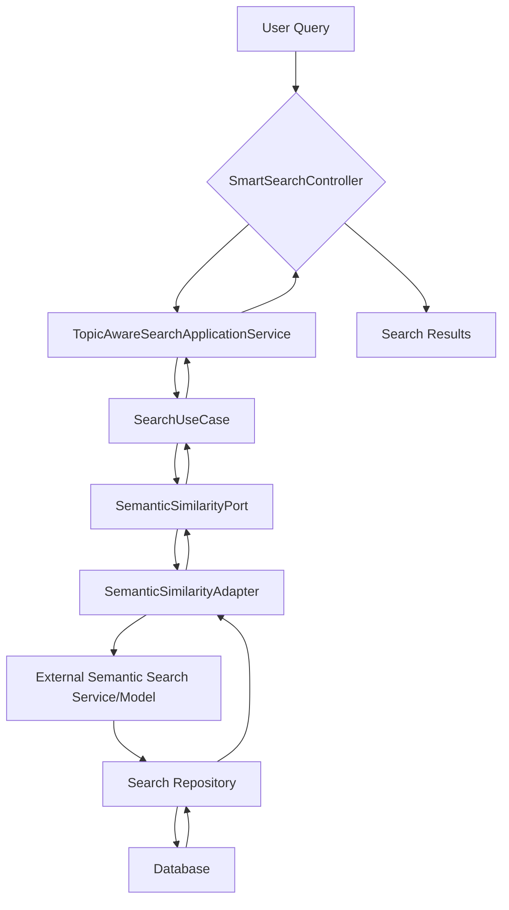

# Smart Search Service

## Project Overview

The Smart Search Service is a Spring Boot application designed to provide an intelligent and robust search experience. It leverages advanced natural language processing (NLP) capabilities, including topic modeling and semantic similarity, to understand user queries and deliver highly relevant results. Additionally, the service incorporates a distributed rate-limiting and IP blacklisting mechanism using Redis to ensure stability, prevent abuse, and protect against traffic spikes.

## Features

*   **Topic-Aware Semantic Search**: Understands the meaning and context of user queries beyond simple keyword matching.
*   **Distributed Rate Limiting**: Protects the service from excessive requests using a Redis-backed token bucket algorithm.
*   **IP Blacklisting**: Defends against DDoS attacks and aggressive scanning by temporarily blocking malicious IP addresses.
*   **Scalable Architecture**: Built with Spring Boot, allowing for easy deployment and scaling.
*   **Configurable**: Rate limiting, blacklisting, and search parameters can be easily configured via `application.properties`.
*   **Comprehensive Logging**: Provides detailed logs for monitoring and troubleshooting.

## Architecture Overview

The semantic search functionality is integrated into the existing search pipeline, enhancing it with advanced NLP capabilities.



## Rate Limiting and Blacklisting with Redis

The system employs a two-layered protection mechanism against traffic spikes and malicious behavior, both managed by Redis:

1.  **Token Bucket Rate Limiting**: Each client IP address is assigned a "bucket" of tokens that refills at a set interval. Every request consumes a token, and if the bucket is empty, the server responds with a `429 Too Many Requests` error.
2.  **IP Blacklisting**: A rolling counter tracks requests from each IP. If an IP exceeds a predefined threshold within a time window, it is temporarily blacklisted, and all subsequent requests are blocked with a `403 Forbidden` error.

All enforcement is handled by the `DDoSProtectionFilter`.

## Semantic Search Implementation

The semantic search functionality aims to provide a search experience that understands the meaning and context of user queries. Key components include:

*   **`TopicAwareSearchApplicationService`**: Orchestrates the semantic search process, analyzing queries for topics and interacting with semantic similarity providers.
*   **`SemanticSimilarityPort`**: An abstraction layer for semantic similarity providers, allowing flexible integration of different implementations.
*   **`SemanticSimilarityAdapter`**: Concrete implementation of the `SemanticSimilarityPort`, connecting to external services or local models for embedding generation and similarity comparisons.
*   **`SearchRepository`**: Interacts with the underlying data store, potentially handling vector-based queries or filtering based on semantic relevance scores.
*   **`SearchRequest` and `SearchResult`**: DTOs defining the structure of search queries and results.

## Getting Started

To get the Smart Search Service up and running, follow these steps:

### Prerequisites

*   Java 17 or higher
*   Maven
*   Docker (for running Redis, PostgreSQL, and MongoDB)

### Setup

1.  **Clone the repository**:
    ```bash
    git clone https://github.com/your-repo/smart-search-service.git
    cd smart-search-service
    ```
2.  **Start Docker Compose services**:
    Ensure you have Docker installed and running. The project relies on Redis, PostgreSQL, and MongoDB.
    ```bash
    docker-compose up -d
    ```
3.  **Build the application**:
    ```bash
    mvn clean install
    ```
4.  **Run the application**:
    ```bash
    java -jar target/smart-search-service-0.0.1-SNAPSHOT.jar
    ```
    The application will start on `http://localhost:8083`.

## Configuration

The application's behavior can be configured via `src/main/resources/application.properties`.

### Rate Limiting and Blacklisting

*   `rate.limit.capacity=15`: Max requests per minute.
*   `rate.limit.refillRate=15`: Tokens added back per minute.
*   `rate.limit.refillIntervalSeconds=60`: Refill interval in seconds.
*   `rate.limit.blacklist.threshold=100`: Requests before blacklisting.
*   `rate.limit.counter.windowSeconds=60`: Time window for request counter.
*   `rate.limit.blacklist.ttlSeconds=300`: Blacklist duration in seconds.

### Redis Connection

*   `spring.data.redis.host=cop-redis`: Redis hostname.
*   `spring.data.redis.port=6379`: Redis port.

For local development, you can override Redis host and port using environment variables:
`export SPRING_REDIS_HOST=localhost`
`export SPRING_REDIS_PORT=6379`

## Local Verification

A test script is provided to verify the rate limiter's behavior:

1.  **Make the script executable**:
    ```bash
    chmod +x ./test_semantic_search.sh
    ```
2.  **Run the script**:
    ```bash
    ./test_semantic_search.sh
    ```
    The script will test the rate limiting and blacklisting by sending multiple requests and checking the HTTP response codes (200, 429, 403).

## Future Enhancements

*   **Advanced Topic Modeling**: Integrate more sophisticated topic modeling techniques.
*   **Personalized Search**: Incorporate user history and preferences for personalized results.
*   **Multi-language Support**: Extend semantic search to multiple languages.
*   **Real-time Indexing**: Implement real-time indexing for up-to-date search results.
