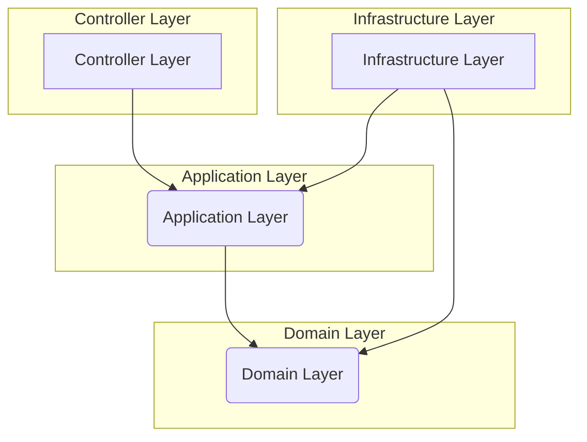

# Smart Search Service Documentation

## 1. Project Overview

The Smart Search Service is a powerful, generic search solution built with Spring Boot. It provides a flexible API for performing advanced search operations across various database tables. Key features include standard full-text search, topic-aware semantic search using Latent Dirichlet Allocation (LDA), and robust security measures like rate limiting and DDoS protection.

This service is designed with a Clean Architecture approach, ensuring a clear separation of concerns, high testability, and easy maintainability.

## 2. Features

-   **Standard Search**: Perform full-text searches on specific tables or across all configured tables.
-   **Topic-Aware Semantic Search**: Utilizes LDA topic modeling to find semantically related documents, even if they don't share keywords. For example, a search for "defence" can return documents about "security."
-   **Dynamic LDA Model Training**: Train the topic model directly from your database content via a simple API call.
-   **Rate Limiting**: Implements a token bucket algorithm to protect against traffic spikes.
-   **DDoS Protection**: Includes IP blacklisting to block malicious actors.
-   **Clean Architecture**: A modular and maintainable codebase.
-   **Comprehensive Logging**: Logs detailed search and performance metrics to MongoDB.
-   **API Documentation**: Self-documented API using OpenAPI (Swagger).

## 3. Architecture

The application follows the principles of **Clean Architecture**, which organizes the code into distinct, independent layers. This design ensures that business logic is independent of frameworks, databases, and UI.



-   **Domain Layer (`com.assistant.smartsearch.domain`)**: The core of the application. It contains the business models (e.g., `SearchResult`, `SearchRequest`) and the interfaces (ports) that define the business rules (e.g., `SearchUseCase`, `SearchRepository`). This layer has no external dependencies.

-   **Application Layer (`com.assistant.smartsearch.application`)**: Orchestrates the data flow by implementing the use cases defined in the Domain layer. It depends on the Domain layer but not on the specifics of the infrastructure.

-   **Infrastructure Layer (`com.assistant.smartsearch.infrastructure`)**: Contains the concrete implementations of the ports defined in the Domain layer. This is where all external dependencies like databases (PostgreSQL, MongoDB), external services (Redis), and frameworks are managed.

-   **Controller Layer (`com.assistant.smartsearch.controller`)**: Exposes the application's functionality as a set of RESTful API endpoints. It handles HTTP requests and responses, delegating the business logic to the Application layer.

## 4. Technologies Used

-   **Backend**: Spring Boot 3
-   **Language**: Java 17
-   **Build Tool**: Maven
-   **Databases**:
    -   **PostgreSQL**: Primary data store for application entities.
    -   **MongoDB**: Used for storing search logs and analytics.
    -   **Redis**: Powers the rate limiting and IP blacklisting features.
-   **Topic Modeling**:
    -   **MALLET**: For the Latent Dirichlet Allocation (LDA) implementation.
-   **API Documentation**:
    -   **OpenAPI (Swagger)**: For generating interactive API documentation.
-   **Containerization**:
    -   **Docker**: For creating a consistent and portable runtime environment.

## 5. Getting Started

### Prerequisites

-   Java 17 or later
-   Docker and Docker Compose

### Installation & Setup

1.  **Clone the repository:**
    ```sh
    git clone <your-repository-url>
    cd cop-chatbot
    ```

2.  **Build the application:**
    This command will compile the code, run tests, and create a JAR file.
    ```sh
    ./mvnw clean install
    ```

3.  **Start the services:**
    This will start the Spring Boot application along with PostgreSQL, MongoDB, and Redis containers.
    ```sh
    docker-compose up -d --build
    ```

4.  **Access the API:**
    The service will be available at `http://localhost:8080`.

5.  **API Documentation:**
    Interactive API documentation (Swagger UI) is available at:
    [http://localhost:8080/swagger-ui.html](http://localhost:8080/swagger-ui.html)

## 6. API Endpoints

### Standard Search

#### `POST /api/smart-search`

Performs a standard full-text search on a specific table or across all tables.

**Request Body:**
```json
{
  "query": "your search query",
  "tableName": "your_table_name",
  "searchFields": ["field1", "field2"],
  "size": 20
}
```

**Example Request:**
```bash
curl -X POST http://localhost:8080/api/smart-search \
-H "Content-Type: application/json" \
-d 
{
  "query": "example search",
  "tableName": "products"
}
```

### Topic-Aware Semantic Search

#### `POST /api/chatbot`

Performs a semantic search using the trained LDA topic model. This endpoint is ideal for natural language queries where understanding the user's intent is crucial.

**Request Body:**
```json
{
  "query": "how to protect against phishing"
}
```

**Example Request:**
```bash
curl -X POST http://localhost:8080/api/chatbot \
-H "Content-Type: application/json" \
-d 
{
  "query": "how to protect against phishing"
}
```

### LDA Model Management

#### `POST /api/model/train`

Asynchronously trains the LDA topic model using the content from a specified database table.

**Example Request:**
```bash
curl -X POST "http://localhost:8080/api/model/train?tableName=actualities"
```

**Response:**
```json
{
  "status": "Model training started",
  "table": "actualities",
  "message": "LDA model is being trained asynchronously. Check /api/topics/model/status for progress.",
  "processingTimeMs": 145
}
```

#### `GET /api/model/status`

Checks the status of the LDA model, including whether it's trained, the number of documents it was trained on, and the discovered topics.

**Example Request:**
```bash
curl -X GET http://localhost:8080/api/model/status
```

**Response:**
```json
{
  "trained": true,
  "numDocuments": 150,
  "numTopics": 10,
  "vocabularySize": 2500,
  "topics": {
    "0": ["security", "attack", "defence", "protection", "cyber", "threat"],
    "1": ["data", "privacy", "encryption", "confidential", "information"]
  }
}
```

#### `DELETE /api/model`

Clears the currently trained LDA model from memory, allowing it to be retrained.

**Example Request:**
```bash
curl -X DELETE http://localhost:8080/api/model
```

## 7. Configuration

The application is configured via `src/main/resources/application.properties`.

### Database Configuration

-   `spring.datasource.url`: JDBC URL for PostgreSQL.
-   `spring.datasource.username`: PostgreSQL username.
-   `spring.datasource.password`: PostgreSQL password.
-   `spring.data.mongodb.uri`: Connection string for MongoDB.

### Redis Configuration

-   `spring.data.redis.host`: Redis hostname (defaults to `cop-redis`).
-   `spring.data.redis.port`: Redis port (defaults to `6379`).

For local development, you can override the Redis host:
```sh
export SPRING_DATA_REDIS_HOST=localhost
```

## 8. Rate Limiting and DDoS Protection

The service uses Redis to implement two layers of protection:

1.  **Token Bucket Rate Limiting**: Each IP address has a bucket of tokens. Each request consumes a token. If the bucket is empty, the request is rejected with an `HTTP 429 Too Many Requests` error. This prevents any single user from overwhelming the service.

2.  **IP Blacklisting**: A counter tracks the number of requests from each IP. If an IP exceeds a configured threshold within a time window, it is temporarily blacklisted, and all its requests are blocked with an `HTTP 403 Forbidden` error. This is a simple but effective defense against DDoS attacks.

All protection logic is centralized in the `DDoSProtectionFilter`.

## 9. Topic Modeling (LDA)

The semantic search feature is powered by Latent Dirichlet Allocation (LDA), a topic modeling technique. Instead of just matching keywords, the system can understand the underlying topics in your documents and queries.

-   **How it works**: When you train the model, it analyzes the documents in your database and automatically discovers a set of "topics" (clusters of related words). When a user searches, the system infers the topic distribution of the query and finds documents with a similar topic distribution.
-   **Training**: The model is not pre-trained. You must train it on your own data using the `/api/model/train` endpoint. For best results, use a dataset with at least 50-100 documents.

## 10. Logging

The service logs detailed information about each search request to a MongoDB collection named `search_logs`. This is valuable for:

-   **Analytics**: Understanding user search behavior.
-   **Performance Monitoring**: Tracking search latency and other metrics.
-   **Improving Search Relevance**: Analyzing search patterns to fine-tune the scoring and topic models.

## 11. Testing

To run the unit and integration tests, use the following Maven command:
```sh
./mvnw test
```

## 12. Versioning

This project uses [Semantic Versioning (SemVer)](http://semver.org/).

## 13. License

Copyright (c) 2025 ZenithSoft. All Rights Reserved.
