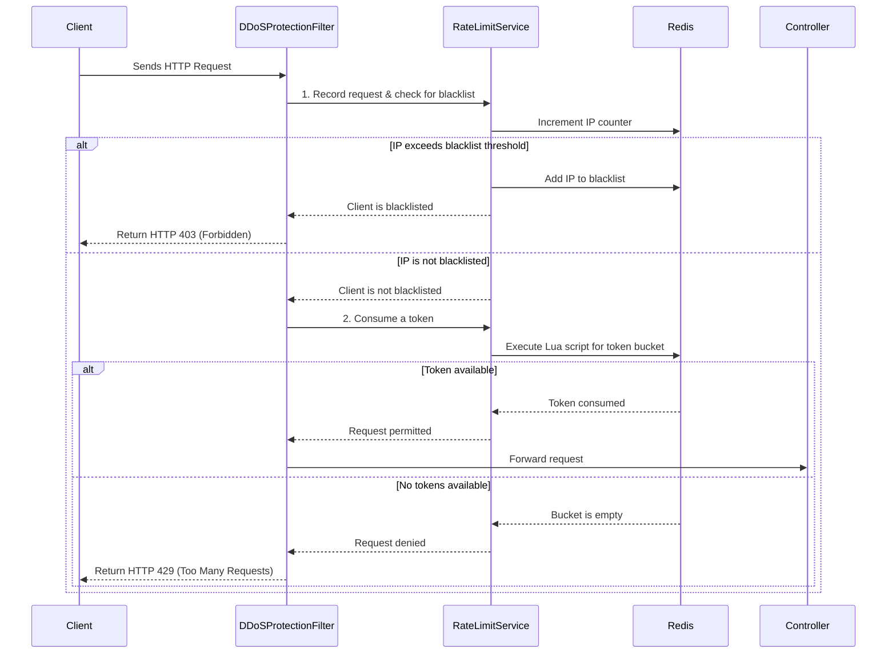

# Rate Limiting and Blacklisting with Redis

This guide provides a simple explanation of the rate limiting and IP blacklisting features in this service.

## 1. Overview

The system uses two layers of protection to guard against traffic spikes and malicious behavior, both of which are managed by Redis:

1.  **Token Bucket Rate Limiting**: Each client IP address is given a "bucket" of tokens that refills at a set interval. Every request consumes a token. If the bucket is empty, the server rejects the request with a `429 Too Many Requests` error. This prevents a single user from overwhelming the service.
2.  **IP Blacklisting**: A rolling counter tracks the total number of requests from each IP. If an IP exceeds a certain threshold within a time window, it is temporarily blacklisted, and all subsequent requests are blocked with a `403 Forbidden` error. This is designed to stop DDoS attacks or aggressive scanners.

All enforcement happens in a single place: `DDoSProtectionFilter`.

## 2. How It Works



## 3. Configuration

You can configure the rate limiter and blacklist settings in `src/main/resources/application.properties`.

### Token Bucket (Rate Limiting)

-   `rate.limit.capacity=15`: The maximum number of requests allowed per minute.
-   `rate.limit.refillRate=15`: The number of tokens added back to the bucket every minute.
-   `rate.limit.refillIntervalSeconds=60`: The interval for refilling tokens (60 seconds = 1 minute).

### Blacklist (DDoS Protection)

-   `rate.limit.blacklist.threshold=100`: The total number of requests an IP can make in the time window before being blacklisted.
-   `rate.limit.counter.windowSeconds=60`: The time window (in seconds) for the request counter.
-   `rate.limit.blacklist.ttlSeconds=300`: How long an IP remains blacklisted (in seconds).

### Redis Connection

-   `spring.data.redis.host=cop-redis`: The Redis hostname.
-   `spring.data.redis.port=6379`: The Redis port.

For local development, you can override the Redis host and port using environment variables:

```sh
export SPRING_REDIS_HOST=localhost
export SPRING_REDIS_PORT=6379
```

## 4. Local Verification

A test script is included in the repository to verify the rate limiter's behavior.

1.  Make the script executable:
    ```sh
    chmod +x ./test_redis_rate_limiting.sh
    ```
2.  Run the script:
    ```sh
    ./test_redis_rate_limiting.sh
    ```

The script will:
-   Send 15 requests that should succeed (`200 OK`).
-   Send subsequent requests that should be rate-limited (`429 Too Many Requests`).
-   Send enough traffic to trigger the blacklist and confirm a `403 Forbidden` response.
