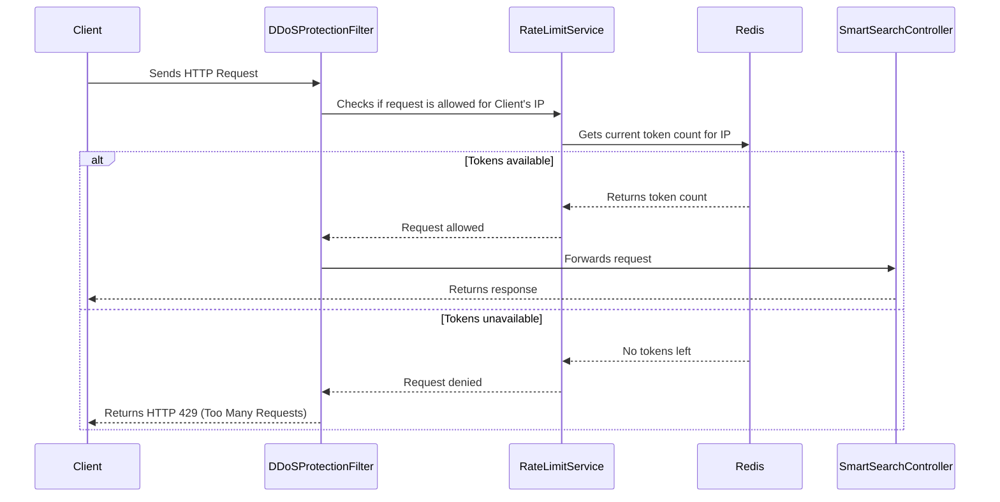

# Rate Limiting with Redis in Smart Search Service

## 1. Overview

This document outlines the implementation of a robust, distributed rate-limiting mechanism using **Redis** and **Spring Boot** in the Smart Search Service. The goal is to protect the service from excessive requests, prevent abuse, and ensure high availability for all users.

The rate-limiting strategy is based on the **token bucket algorithm**, which is a flexible and effective way to handle traffic bursts while maintaining a fair usage policy.

## 2. Core Components

The rate-limiting implementation consists of the following components:

- **`RateLimitService`**: A service responsible for checking if a request is allowed based on the client's IP address.
- **`DDoSProtectionFilter`**: A servlet filter that intercepts incoming requests and uses the `RateLimitService` to enforce rate limits.
- **`RedisRateLimitConfig`**: A configuration class that sets up the necessary Redis beans.
- **`application.properties`**: The configuration file where rate-limiting parameters are defined.

## 3. How It Works

The rate-limiting process works as follows:

1.  **Request Interception**: The `DDoSProtectionFilter` intercepts every incoming HTTP request.
2.  **Client Identification**: The client's IP address is extracted from the request. This IP address is used as a unique key for rate limiting.
3.  **Rate Limit Check**: For each request, the `RateLimitService` communicates with Redis to check if the client has exceeded their allowed request limit.
4.  **Token Bucket Algorithm**: The service uses a Redis-backed implementation of the token bucket algorithm. Each client (IP address) has a "bucket" of tokens that refills at a constant rate. Each request consumes one token.
5.  **Request Handling**:
    - If the client's bucket has enough tokens, the request is allowed to proceed to the controller.
    - If the bucket is empty, the request is rejected with an **HTTP 429 (Too Many Requests)** status code.

### Visual Workflow



## 4. Implementation Details

### 4.1. `RateLimitService`

The `RateLimitService` uses a Lua script to perform an atomic check-and-decrement operation in Redis. This ensures that the rate-limiting logic is race-condition-free.

Here is a simplified version of the `allowRequest` method:

```java
@Service
public class RateLimitService {

    private final RedisTemplate<String, String> redisTemplate;
    private final DefaultRedisScript<Long> redisScript;

    // ... constructor ...

    public boolean allowRequest(String ipAddress) {
        Long tokens = redisTemplate.execute(
            redisScript,
            Collections.singletonList(ipAddress),
            "100", // Bucket capacity
            "100", // Refill rate
            "60"   // Refill interval in seconds
        );

        return tokens != null && tokens > 0;
    }
}
```

### 4.2. Lua Script for Atomicity

The Lua script is essential for ensuring that the token bucket logic is atomic. It performs the following actions in a single Redis command:

1.  Gets the current number of tokens in the bucket.
2.  Calculates how many new tokens should be added since the last request.
3.  Updates the token count.
4.  If there are enough tokens, it decrements the count and returns `1`. Otherwise, it returns `0`.

### 4.3. `DDoSProtectionFilter`

The `DDoSProtectionFilter` is a standard Spring `OncePerRequestFilter`. It extracts the client's IP and calls the `RateLimitService`.

```java
@Component
public class DDoSProtectionFilter extends OncePerRequestFilter {

    private final RateLimitService rateLimitService;

    // ... constructor ...

    @Override
    protected void doFilterInternal(HttpServletRequest request, HttpServletResponse response, FilterChain filterChain)
            throws ServletException, IOException {
        String clientIP = getClientIP(request);

        if (!rateLimitService.allowRequest(clientIP)) {
            response.setStatus(HttpServletResponse.SC_TOO_MANY_REQUESTS);
            response.getWriter().write("Too many requests");
            return;
        }

        filterChain.doFilter(request, response);
    }

    // ... getClientIP method ...
}
```

## 5. Configuration

The rate-limiting parameters can be configured in the `application.properties` file:

```properties
# Rate Limiting Configuration
rate.limit.capacity=100
rate.limit.refillRate=100
rate.limit.refillIntervalSeconds=60
```

- **`rate.limit.capacity`**: The maximum number of requests allowed in a time window (bucket size).
- **`rate.limit.refillRate`**: The number of tokens added to the bucket at each refill.
- **`rate.limit.refillIntervalSeconds`**: The interval (in seconds) at which the bucket is refilled.

## 6. Disabling the Old `DDoSProtectionFilter`

The old in-memory `DDoSProtectionFilter` is not suitable for a distributed environment and should be disabled. This can be done by removing the `@Component` annotation from the class.

The new implementation provides a more scalable and robust solution for protecting the Smart Search Service.
